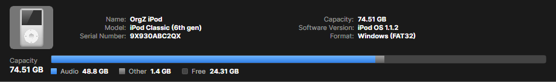

# iPods & Rockbox players

OrgZ recognizes iPods and Rockbox-based players when you plug them in,
identifies the exact model, and reads their music library into the app. This
page covers connecting a device, what OrgZ can detect, and how it remembers
each device.

## Supported devices

| Device | How OrgZ reads it | Writable? |
|--------|-------------------|-----------|
| **iPod running Apple firmware** ("stock") | Parses the on-device **iTunesDB** (or **iTunesSD** on Shuffles, SQLite on the Nano 5G) | Read / write - see [Supported Hardware](supported-hardware.md) |
| **iPod running [Rockbox](https://www.rockbox.org/)** | Walks the filesystem and reads tags with TagLib | Read / write |
| **Other Rockbox players** (Sansa, iRiver, Cowon, FiiO, ...) | Same filesystem walk | Read / write |
| **Generic USB players** | Removable drive with audio files | Read / write |

!!! note "Writing to stock iPods"
    OrgZ writes each generation's native database directly - the plain iTunesDB,
    the hash58-checksummed variant (Classic, Nano 3G/4G), the Nano 5G's SQLite
    library, and the Shuffle's iTunesSD play order - no iTunes required. Tracks
    the device can't decode are transcoded on the way in (lossless where the
    hardware allows), and on Shuffles you can drag rows in the track grid to
    change the device's play order. See [Supported Hardware](supported-hardware.md)
    for every model, its database tier, and its transcode target. The Nano 6G/7G
    and iPod Touch stay read-only: their databases require a signature with no
    open-source implementation.

## Connecting

Plug the device in over USB. OrgZ detects it automatically and adds it to a
**Devices** group in the sidebar - with a product image for recognized iPod
generations, or a fallback icon. A scan starts immediately; tracks stream into
the library grid as they're read, and the activity panel shows progress.

Selecting the device shows its **info bar** with everything OrgZ could identify:

- **Model**: the decoded iPod identity (e.g. *iPod Classic 6G 80 GB*). Click the
  Model label to toggle to the raw **hardware** model instead - handy on modded
  iPods, where this reveals the storage adapter (e.g. *iFlash*) behind the Apple shell.
- **Apple model number** (e.g. `MA446LL/A`), **serial**, and **FireWire GUID**.
- **Firmware**: shows both where applicable, e.g. *iPod OS 1.3 / Rockbox 3.15*.
- **Format**: normalized to *Windows (FAT32)*, *Mac (HFS+)*, or *Linux (ext4)*.
- **Capacity bar**: audio vs. other vs. free space.

### Where the identity comes from

OrgZ pulls identity from whichever source a given device and firmware mode
exposes - SysInfo, SCSI `INQUIRY` VPD data, Apple opcode `0xC6`, the Rockbox
target string, and (on Windows) the WMI disk descriptor. No single source is
complete, which is why OrgZ keeps a per-device record (below).

## The `.orgz/device` record

The first time you select a device, OrgZ writes a small text file to
`/.orgz/device` on the device itself. It's a plain `Key=Value` record (with a
header comment) and is **safe to delete**: OrgZ regenerates it.

Its purpose is to **accumulate identity across firmware boots**. When an iPod
boots Rockbox, the USB bridge hides the Apple serial and GUID; when it boots
Apple firmware, those become visible but the Rockbox version doesn't. By merging
what each boot reveals, OrgZ builds a complete picture over time. The record
tracks when the device was last seen in each mode (`LastSeenStock`,
`LastSeenRockbox`).

Rockbox devices also get a `/.orgz/library.db` cache so repeat connects don't
have to re-scan and re-tag every file.

!!! tip "Refreshing identity"
    If you edit `/.orgz/device` by hand, or reboot the device into a different
    firmware mode, use **Refresh device info** on the device to re-fingerprint it
    without unplugging and replugging.

## Recognized generations

OrgZ ships product imagery for these iPod generations (others still work - they
just fall back to a generic icon):

iPod 4G · Photo · Mini 1G/2G · Video 5G/5.5G · Classic 6G/6.5G/7G ·
Nano 1G/2G/7G · Shuffle 4G

Next: [Playlists & syncing](syncing.md) covers browsing the device library,
sending playlists, and ejecting safely.
