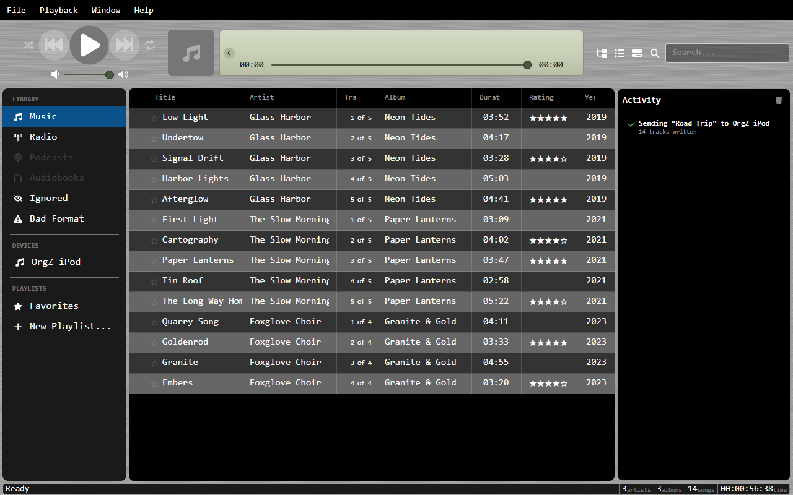

# Playlists & syncing

Once a device is connected (see [iPods & Rockbox players](ipod-rockbox.md)), you
can browse its library, copy playlists onto writable devices, and eject it
safely.

## Browsing the device library

The device's tracks load into the main grid when you select it in the sidebar.
They're kept separate from your local library — your *Music Library* view won't
be cluttered with device tracks, and vice versa.

Each device also has a **Playlists** entry beneath it in the sidebar:

- **Stock iPods** — playlists come from the iTunesDB.
- **Rockbox / other** — playlists are read from `*.m3u` files in the device's
  `/Playlists/` folder.

## Sending a playlist to a device

Right-click one of your library playlists and choose **Send to device**.

!!! warning "What this does — and doesn't do"
    Sending a playlist writes an **M3U file** to the device's `/Playlists/` folder
    that references tracks **already on the device**. It does **not** copy the
    audio files themselves. OrgZ matches your playlist's tracks to the device's
    library by **artist + title**; any track that isn't already on the device is
    reported as "not found" and skipped (the rest still go through).

The written playlist uses Rockbox-style device-absolute paths (e.g.
`/Music/Rush/Signals/01.mp3`) so the device resolves them no matter where it's
mounted on your computer. The new playlist appears under the device immediately —
no reconnect needed.

This is only available for **writable** devices. Stock (Apple-firmware) iPods are
read-only, so the option is disabled for them.

## Ejecting

Right-click the device and choose **Eject** to safely remove it. OrgZ unmounts
the volume and tears down its sidebar entry once the OS confirms removal. Always
eject before unplugging so an in-progress write (like a freshly sent playlist)
is fully flushed.

## Troubleshooting

| Symptom | Likely cause |
|---------|--------------|
| Device doesn't appear | Not mounted yet, or (Linux) your user lacks access — see [Installation](../getting-started/installation.md). |
| "Send to device" is greyed out | The device is a read-only stock iPod. Install Rockbox for read/write. |
| Most tracks "not found on device" when sending | The playlist references tracks that aren't on the device; only matching artist+title pairs are written. |
| Wrong model / missing identity | Re-run **Refresh device info**, or boot the iPod into Apple firmware once so OrgZ can read its serial and GUID. |
