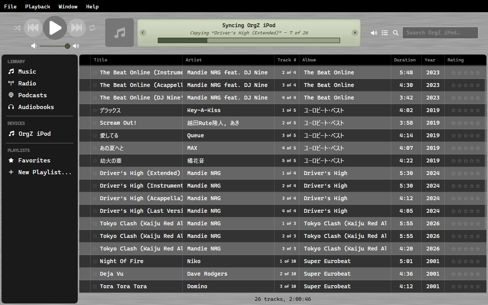

# Playlists & syncing

Once a device is connected (see [iPods & Rockbox players](ipod-rockbox.md)), you
can browse its library, copy playlists onto writable devices, and eject it
safely.

## Browsing the device library

The device's tracks load into the main grid when you select it in the sidebar.
They're kept separate from your local library - your *Music Library* view won't
be cluttered with device tracks, and vice versa.

Each device also has a **Playlists** entry beneath it in the sidebar:

- **Stock iPods**: playlists come from the iTunesDB.
- **Rockbox / other**: playlists are read from `*.m3u` files in the device's
  `/Playlists/` folder.

## Syncing a playlist to a device

Right-click one of your library playlists and choose **Sync**, then the device.
The submenu lists every connected device whose sync tier can take tracks - stock
(Apple-firmware) iPods included; see
[Supported Hardware](supported-hardware.md). With nothing suitable connected it
reads *No compatible devices*.

Syncing copies the **tracks themselves**, transcoding on the way in when the
model can't play the source format (a FLAC becomes ALAC or AAC for a stock iPod;
Rockbox players take the file as-is). It then writes the playlist into whatever
database that generation uses - the Nano 5G's SQLite, the binary iTunesDB, or an
`.m3u8` in the device's `/Playlists/` folder for Rockbox.

Tracks already on the device are matched by **artist + title** and reused rather
than copied twice. A track whose file is missing locally is skipped and counted
as a failure; the rest still go through.

The new playlist appears under the device immediately - no reconnect needed.

!!! tip "Keep syncing after you close OrgZ"
    With **Settings → Services → Keep Running After OrgZ Closes → iPod sync**
    ticked, the file copy is handed to the background service, so quitting OrgZ
    mid-sync doesn't abandon it.

## Ejecting

Right-click the device and choose **Eject** to safely remove it. OrgZ unmounts
the volume and tears down its sidebar entry once the OS confirms removal. Always
eject before unplugging so an in-progress write (like a freshly sent playlist)
is fully flushed.

## Troubleshooting

| Symptom | Likely cause |
|---------|--------------|
| Device doesn't appear | Not mounted yet, or (Linux) your user lacks access - see [Installation](../getting-started/installation.md). |
| **Sync** says "No compatible devices" | Nothing is connected whose sync tier can write tracks - a Nano 6G/7G or an iPod Touch, for instance. |
| Sync stops with "ffmpeg wasn't found" | A stock iPod needs ffmpeg to transcode. It ships with the release packages; a build run from source needs it on `PATH`. |
| Wrong model / missing identity | Re-run **Refresh device info**, or boot the iPod into Apple firmware once so OrgZ can read its serial and GUID. |
