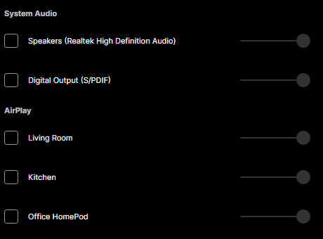
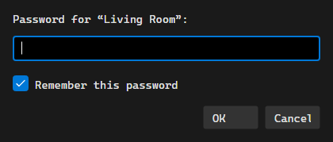

# AirPlay

OrgZ streams to AirPlay receivers directly - HomePods, Apple TVs, AirPort
Expresses, and third-party AirPlay speakers. No iTunes, no Bonjour service, and
no helper app: discovery and streaming are built in, on every platform OrgZ runs
on.

## Picking a speaker

The speaker icon next to the volume slider (in the main window and in the
mini-player - it is the same picker) lists every output OrgZ can see, grouped by
where it came from. AirPlay receivers appear under **AirPlay** as they answer
mDNS.

- Tick a device to send audio to it, untick it to stop.
- Each row has its own volume slider, independent of the master volume.
- **You can tick more than one.** Audio is fanned out to every ticked output at
  once - laptop speakers plus the kitchen HomePod, for instance.
- A receiver seen by name but not yet resolved to an address shows as
  *unreachable* and can't be ticked, rather than silently swallowing the audio.

A small play or pause glyph on a row means the receiver told the network it is
already busy. Ticking a busy speaker asks first (**Take Over**), because an
AirPlay receiver hands itself to a new session without a word to whoever was
using it.

!!! note "Two outputs, one song, no echo"
    An AirPlay receiver is handed audio around two seconds before it plays it; a
    sound card plays it almost immediately. When both are ticked, OrgZ delays the
    faster output to match, so the same song doesn't arrive twice from two rooms.
    The delay is carried across track boundaries, so gapless stays gapless.

## Passwords

A receiver with **Require Password** set for speaker access (the Home app's
setting) announces that fact, and OrgZ asks for the password before it plays -
also when the receiver rejects one it was given.

Tick **Remember** in the prompt to keep it. Passwords go to the operating
system's secret store (DPAPI on Windows, Keychain on macOS, libsecret on Linux),
never to `settings.json`. If the system has no secret store, OrgZ keeps the
password for the session only and says so rather than pretending to have saved
it.

## What the speaker shows

While a session is up, OrgZ pushes the same now-playing information an iPhone
does: title, artist, album, elapsed/total time, and the cover art (resized to
600×600 before it goes out, which is what the reference sender does and what a
speaker's display can actually use).

Controls come back the other way. OrgZ publishes the DACP control endpoint
iTunes has always used, so the buttons on a HomePod tile - or in Control Centre,
or on the speaker itself - drive playback here: play, pause, play/pause toggle,
stop, next, previous. Volume changed on the speaker is followed by the row's
slider in the picker rather than fought over.

## AirPlay 1 and AirPlay 2

OrgZ speaks both, and picks per receiver:

- **AirPlay 1 (RAOP)** - AirPort Expresses and most third-party speakers: RTSP
  handshake, RSA-wrapped AES key, ALAC audio over RTP.
- **AirPlay 2** - HomePods and modern Apple hardware: transient pairing, a
  plist-negotiated setup, and ALAC frames individually sealed with
  ChaCha20-Poly1305.

For timing, a receiver that advertises PTP gets PTP (joining its timing group is
what makes it treat the stream as a real AirPlay 2 source); everything else gets
the NTP model.

## Troubleshooting

| Symptom | Likely cause |
|---------|--------------|
| No AirPlay group in the picker | Discovery is a background mDNS sweep - give it a couple of seconds after opening the picker. mDNS also does not cross subnets or most guest/VLAN boundaries. |
| Device listed as "unreachable" | It was announced but its address hasn't resolved yet, or it is asleep. |
| Asked for a password repeatedly | The password was refused; the prompt reopens with an empty box so you can retype it. |
| Speaker plays but shows nothing / no controls | The receiver dropped the metadata push. Untick and re-tick the device to rebuild the session. |
| A HomePod stutters or refuses to start | Ports 319/320 (PTP) may be blocked on your network. Setting `AirPlay.EnablePtp` to `false` in `settings.json` forces the older NTP timing path. |
