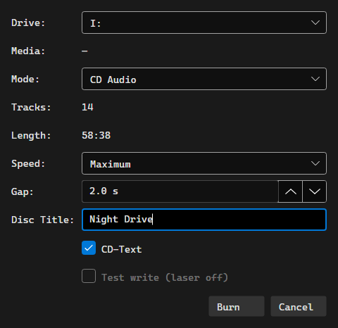

# Burning Discs

OrgZ writes audio CDs and data discs directly to the drive - no third-party
burning app, no cue-sheet wrangling.

## Starting a burn

Two ways in, both landing on the same **Burn Disc** dialog:

- Open a playlist (or **Favorites**) and click **Burn Disc…** in the header. The
  button appears only when an optical drive is present. The playlist's name
  becomes the disc title.
- Select tracks anywhere in your library, right-click, and choose **Burn to CD…**.

Tracks with no local audio file - radio stations sitting in Favorites, for
instance - are skipped.

## The Burn Disc dialog

| Field | What it does |
|-------|--------------|
| **Drive** | The recorder to write with. OrgZ probes the selected drive live. |
| **Media** | What's actually in the tray: blank/not blank, type, capacity. |
| **Mode** | **CD Audio**, **CD Data**, or **DVD Data**. Modes the loaded disc can't take are disabled. |
| **Tracks / Length** | For audio, the running time against the disc's capacity; for data, bytes. Over capacity turns red, a **Discs** row shows how many discs the set would need, and **Burn** is disabled. |
| **Speed** | Write speed for audio burns (Maximum, 24x, 16x, 8x, 4x). |
| **Gap** | Silence between tracks, 0-5 s in half-second steps. 0 is a gapless disc. |
| **Disc Title** | CD-TEXT disc title on an audio burn, volume label on a data disc. |
| **CD-Text** | Writes disc and per-track artist/title into the lead-in. Audio only. |
| **Test write (laser off)** | Simulates the whole burn. Offered only on write-once media - MMC forbids simulation on high-speed rewritables. |

If the disc isn't blank but is erasable, OrgZ offers to quick-erase it first;
otherwise a used disc is refused.

## Audio CDs

A Red Book disc needs 16-bit / 44.1 kHz / stereo PCM, so every track is
converted to a sector-aligned WAV first (that's the "Converting…" phase), then
the whole disc is written **Disc-At-Once** from a full cue sheet. The disc
carries at most 99 tracks, and each track is at least 4 seconds long.

CD-TEXT carries each track's title and artist; the disc performer line is
written when every track shares one artist.

!!! warning "A started burn can't be cancelled"
    Cancelling during the conversion phase is clean. Once the laser is writing,
    the Cancel button stops offering - aborting mid-write is a guaranteed
    coaster. The drive ejects when it finishes.

## Data discs

Data mode writes an ISO 9660 / Joliet / UDF disc laid out as
`Artist/Album/file`. CD-R and CD-RW are written TAO Mode 1; a DVD+RW is
overwritten in place.

By default your files are copied as they are. **Settings → Burning → Data Disc**
can convert them on the way out instead - MP3, AAC, Apple Lossless, FLAC, or WAV
at 128/192/256/320 kbps for the lossy formats - which is how you fit a FLAC
library onto a disc a car stereo will read. Files already in the target format
pass through untouched.

## Settings

**Settings → Burning** holds the defaults the dialog opens with:

- **Audio CD**: gap between songs (none/gapless or 2 seconds) and whether to
  write CD-TEXT.
- **Data Disc**: the conversion format and the lossy bitrate above.
- **Disc Image**: where disc images live - `.disc-images` inside your music
  library folder. Not configurable; it is shown so you know where to look.

## Permissions

Writing to a drive needs raw SCSI access, which is privileged on Windows. If the
background service is installed (the MSI registers it), the burn runs through it
silently - and keeps running even if you close OrgZ. Otherwise Windows asks for
consent once per burn. On macOS and Linux the write runs in-process; on Linux
your user needs access to the drive, which usually means the `cdrom` group - see
[Installation](../getting-started/installation.md).

## Troubleshooting

| Symptom | Likely cause |
|---------|--------------|
| No **Burn Disc…** button | No optical drive was detected, or the view isn't a playlist / Favorites. |
| "ffmpeg wasn't found" | Audio burns transcode through ffmpeg. It ships with the release packages; a build run from source needs it on `PATH`. |
| **Burn** is greyed out | The mode isn't valid for the loaded disc, no blank disc is in the tray, or the set is over capacity. |
| Drive reports busy | A prior operation left it mid-flight. Eject and reinsert the disc. |
| Test write is greyed out | The disc is rewritable; simulation isn't allowed on it. |
