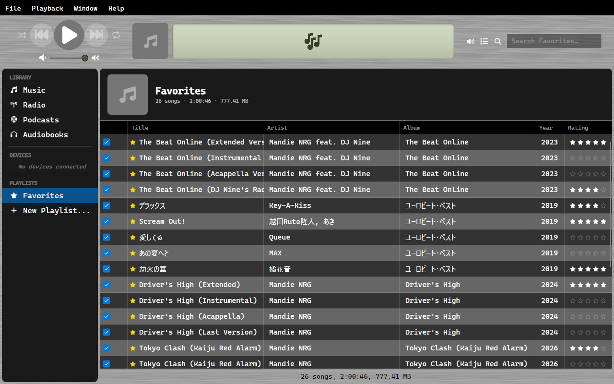

# Favorites

Star any music track or radio station to add it to your Favorites list.

## Adding Favorites

- Right-click a track or station and select **Toggle Favorite**
- Click the star icon next to any title in the list
- Drag a selection onto **Favorites** in the sidebar to star all of it at once

Dropping a selection only adds - tracks that are already favorited stay that way rather than
being toggled off.

## Viewing Favorites

Click **Favorites** in the sidebar under Playlists. This view shows all favorited items across both Music and Radio.

## Favorites.m3u8

Your favorites are also written to `Favorites.m3u8` in your music folder, so other software
can read the list. OrgZ keeps it current as you star and unstar things.

Unlike a [playlist](playlists.md), this one is written but never read back. Favorites is a
flag on each track, not a list, so editing `Favorites.m3u8` by hand has no effect - OrgZ
overwrites it. To change what is in it, star and unstar tracks.

## Playback from Favorites

When you start playing from the Favorites view, the playback context follows that list - next/previous and auto-advance work within your favorites, even if you navigate to another view.
