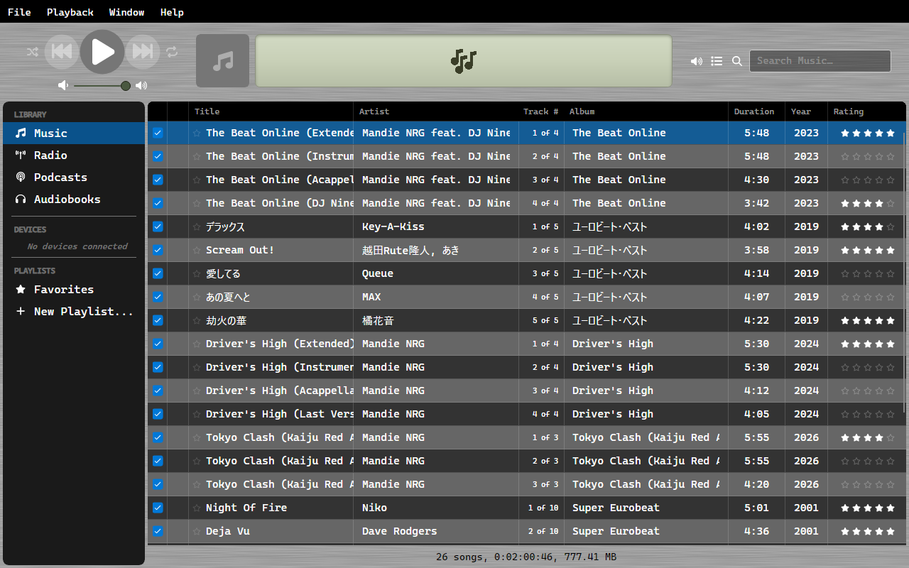
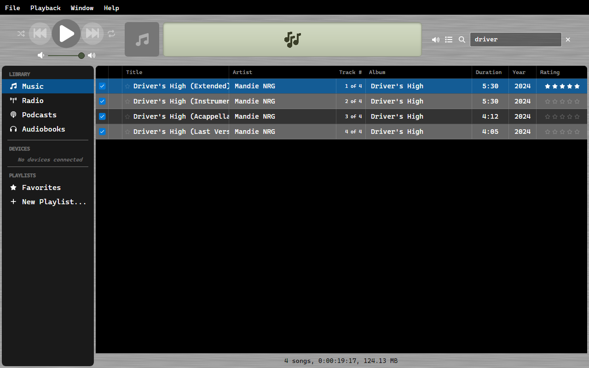
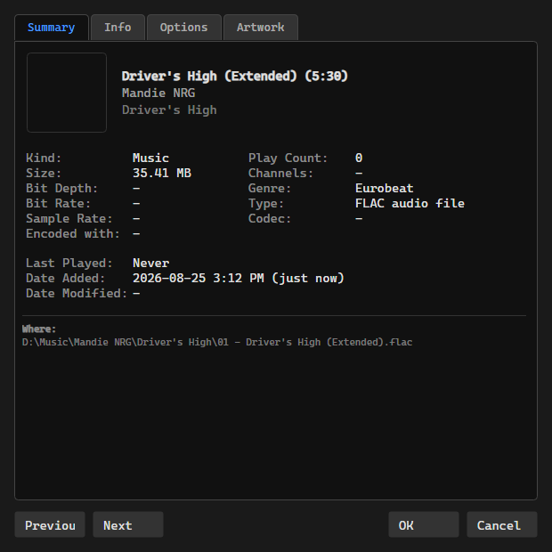
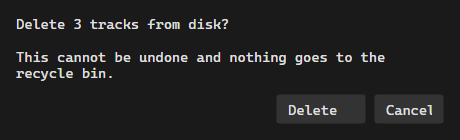

# Music Library

OrgZ scans your selected folder for audio files and extracts metadata using TagLib.

## Supported Formats

| Format | Extensions |
|--------|-----------|
| MPEG Audio | `.mp3` |
| FLAC | `.flac` |
| AAC | `.m4a`, `.aac` |
| MPEG-4 audiobook | `.m4b` (filed under [Audiobooks](audiobooks.md), not Music) |
| Ogg Vorbis | `.ogg` |
| Opus | `.opus` |
| WAV | `.wav` |
| WMA | `.wma` |
| APE | `.ape` |

## Columns

The Music view shows: Title, Artist, Track #, Album, Duration, Year, and Rating, behind the iTunes-style tick column.

Click a column header to sort by it. Drag column headers to reorder them - the order is remembered per view. Right-click a column header to show the columns that are hidden by default: Plays, Extension, and Has Album Art.

## Searching

Press ++ctrl+f++ (or click the search box) and type to filter the current view; the match runs against title, artist, and album. The footer summary (song count, total time, total size) reflects the filtered set, not the whole library. Press ++enter++ to play the first result.

## Ratings

Set a 0-5 star rating on any track from its right-click menu. Ratings show in the Rating column.

## Right-click actions

Right-clicking a track offers **Play**, **Play Next**, **Add to Queue**, **Get Info**, **Rating**, **Add to Playlist**, **Sync** (to a connected device), **Check** / **Uncheck**, **Show in Explorer**, **Burn to CD...**, and **Remove from Library**. Other views trim the list to what applies - a playlist adds **Remove from Playlist**, a read-only share drops the actions that would write.

Right-clicking inside a selection acts on the whole selection. Right-clicking outside one selects that track first, the same way dragging does.

!!! warning "Remove from Library deletes the file"
    **Remove from Library** is not "hide from OrgZ" - it permanently deletes the selected tracks' files from disk. There is no undo and nothing goes to the recycle bin. OrgZ asks for confirmation first, and that dialog is the last chance to stop.

## File Watching

OrgZ monitors your music folder for changes. Added, modified, or deleted files are automatically reflected in the library.

## Changing Library Folder

Open **Settings > General** and use the **Change ...** button next to *Music Library Folder Location*. **Reset** puts it back to the default.
