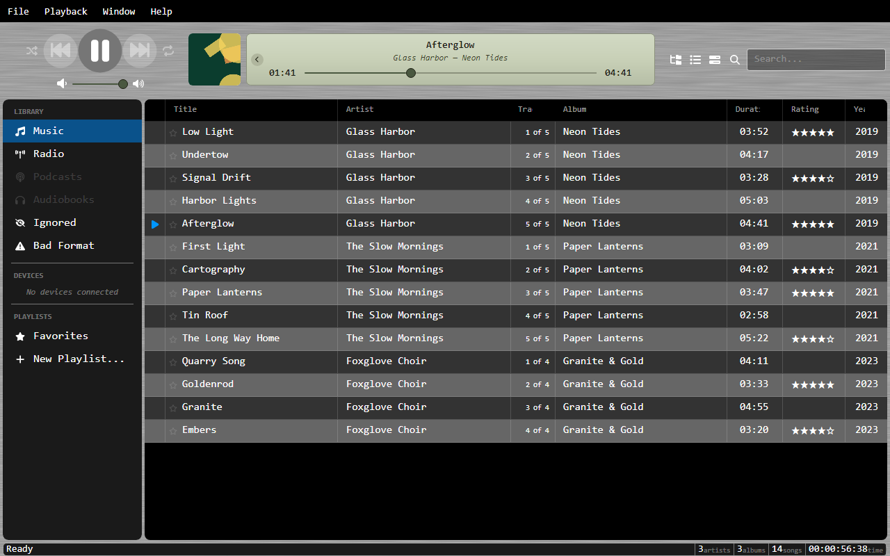
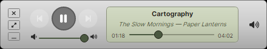

# Playback

OrgZ uses LibVLC for audio playback, so it handles most audio formats and streaming protocols.

## Controls

- **Play/Pause**: Toggle playback
- **Previous/Next**: Navigate within the current playback context
- **Volume**: Slider with mute and max buttons
- **Seek Bar**: Click or drag to seek within a track (disabled for live streams)

## Shuffle and Repeat

- **Shuffle** (++s++) plays the context in a random order. Choose whether it shuffles by song or by whole album in **Settings → Playback**.
- **Repeat** (++r++) cycles between off, repeat-all (the whole context), and repeat-one (the current track).

## Playback Context

When you start playing a track, OrgZ captures a snapshot of the current filtered list as your **playback context**. This means:

- Auto-advance plays the next track from where you started
- Previous/Next navigate within that same list
- Switching views doesn't interrupt playback
- Starting a track from a different view creates a new context

## Live Streams

Radio streams show a "LIVE" duration and an animated progress indicator instead of a seek bar. Live ICY metadata updates the track info display in real time.

## Navigate to Playing

Click the album art or track info area at the top to jump to the currently playing item in its source view.

## Mini-Player

A compact always-handy player strip with transport controls, the seek bar, and now-playing info - for when you don't need the full window.

## Per-Track Options

OrgZ supports per-track volume adjustment, equalizer presets, and start/stop time markers (configured via the track info dialog).

## System Integration

OrgZ mirrors playback to the operating system so hardware and on-screen media controls work:

- **Windows**: media keys (play/pause, next, previous), taskbar thumbnail-toolbar buttons, and System Media Transport Controls.
- **macOS**: the Now Playing panel and media keys.
