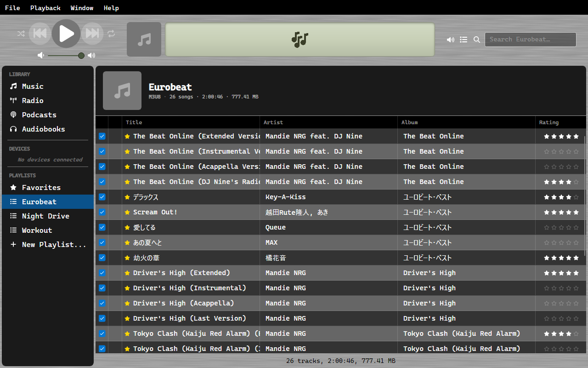
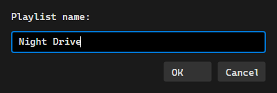

# Playlists

A playlist in OrgZ is a `.m3u8` file in your music folder. There is no separate playlist
database to get out of step with it, and nothing is locked inside OrgZ.

## Making one

Click **New Playlist...** at the bottom of the Playlists section in the sidebar, give it a
name, and drag tracks onto it. The file appears in your music folder immediately as
`<name>.m3u8`.

Every change writes straight through - adding tracks, removing them, dragging to reorder,
renaming the playlist. Rename it in OrgZ and the old file is replaced by one under the new
name.

## Playlists you already have

Drop an `.m3u8` anywhere in your music folder and it becomes a playlist on the next scan.
OrgZ picks up files created by anything - a DJ tool, a text editor, another player - and
there is no import step.

Tracks are matched against your library by path. Entries pointing at files you do not have
are skipped, so a playlist exported from a bigger collection still works for the part you
own.

!!! tip "Paths are relative"
    OrgZ writes track paths relative to your music folder, so a playlist keeps working if
    the library moves to another drive or another machine.

## Deleting

Removing a playlist in OrgZ deletes its file. Deleting the file yourself removes the
playlist from the sidebar on the next scan. Either way there is one thing to delete, not
two.

## Favorites is different

`Favorites.m3u8` is written for other software to read, but never read back - see
[Favorites](favorites.md).
