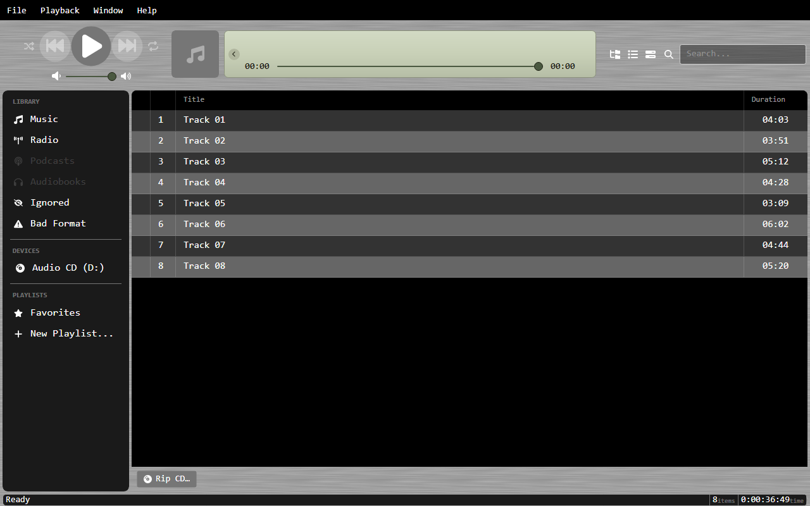
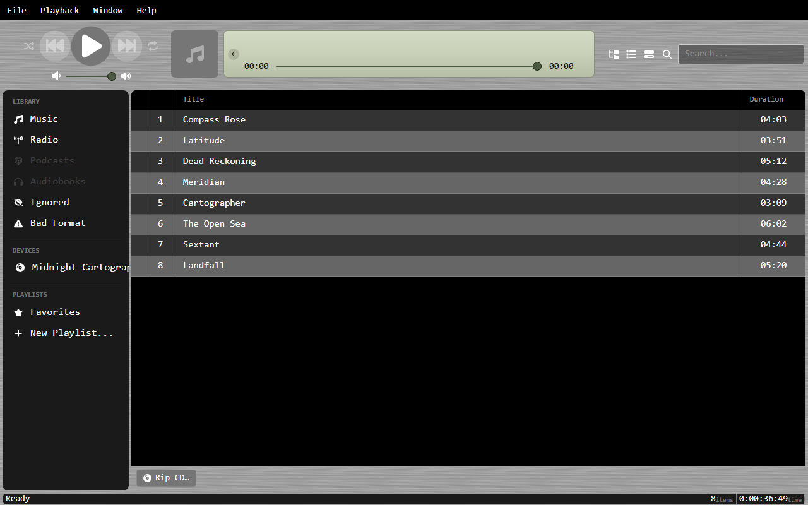
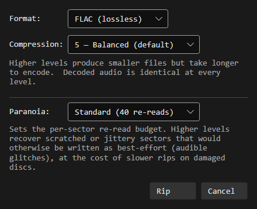

# Ripping CDs

OrgZ rips audio CDs to **WAV**, **FLAC**, or **MP3** with per-track AccurateRip
verification, automatic metadata from MusicBrainz, and embedded cover art. This
page walks through a full rip and explains every option.

## Before you start

- **Encoders.** WAV needs nothing. FLAC and MP3 shell out to `flac` and `lame`.
  OrgZ uses a system copy on your `PATH` first and falls back to the binaries
  bundled with the app, so a normal install can rip FLAC/MP3 out of the box. If
  neither is found you'll get a message telling you how to install them.
- **Windows elevation.** Reading raw CD audio requires administrator rights, so
  OrgZ launches an elevated helper and you'll see a **UAC prompt** each time you
  start a rip. macOS and Linux rip in-process - no prompt, but on Linux your user
  needs access to the optical device (see [Installation](../getting-started/installation.md)).

## 1. Insert the disc

When you insert an audio CD, OrgZ detects it and adds it to the sidebar with all
its tracks read from the disc's table of contents.



## 2. Metadata is fetched automatically

OrgZ computes the disc's [MusicBrainz Disc ID](https://musicbrainz.org/doc/Disc_ID_Calculation)
from the table of contents and looks it up online. On a match it fills in the
album title, artist, year, genre, and per-track titles, and pulls front cover
art from the Cover Art Archive.

If the disc isn't in MusicBrainz, tracks stay as *Track 01*, *Track 02*, ... - you
can still rip; the files just won't be tagged. (You can edit tags afterward from
the track's info dialog.)



## 3. Start the rip

- To rip the **whole disc**, select the CD and choose **Rip CD**.
- To rip **one track**, right-click it and choose **Rip Track**.

OrgZ opens the **Rip Options** dialog. Your last choice is remembered and used as
the default next time.



### Format

| Format | What you get |
|--------|--------------|
| **WAV** | Raw 16-bit / 44.1 kHz stereo PCM - bit-identical to the CD, largest files. No embedded art (a `cover.jpg` is dropped beside the tracks instead). |
| **FLAC** | Lossless compression. Same audio as WAV, smaller files, with tags and embedded cover art. **Recommended for archival.** |
| **MP3** | Lossy, encoded with LAME. Smallest files, with ID3 tags and embedded art. |

### FLAC compression

Levels **0-8** (default **5**, balanced). Higher levels make smaller files and
take longer to encode. **The decoded audio is identical at every level** - only
file size and encode time change.

### MP3 quality

- **VBR (variable bitrate)** - LAME `-V0` ... `-V9`. **V2 (~190 kbps)** is the
  community-standard sweet spot and the default.
- **CBR (constant bitrate)** - a fixed 64-320 kbps across the whole file. Best
  when something downstream needs a predictable bitrate (e.g. some streaming
  setups).

### Paranoia

Sets the per-sector **re-read budget** before OrgZ gives up on a sector and
writes best-effort data:

| Preset | Re-reads | Use for |
|--------|----------|---------|
| **Fast** | 10 | Pristine discs where you want speed. |
| **Standard** | 40 | The default - good recovery without dragging. |
| **Paranoid** | 100 | Scratched or jittery discs. Slower, but recovers sectors that would otherwise become audible glitches. |

## 4. Watch it rip

Tracks rip sequentially. The status area shows the current track, a live
**speed** readout (e.g. `8.5×`) and **time remaining**, and a running
verification verdict per finished track.


Each track is checked against AccurateRip as it completes:

- **✓ Track 03 - AR2 `A1B2C3D4`** - the track ripped cleanly and its AccurateRip
  V2 checksum is recorded.
- **⚠ Track 07 - 4 unverified sector(s) starting at LBA 123456** - some sectors
  exhausted the re-read budget and were written best-effort. These are the most
  likely source of audible clicks. Try a higher **Paranoia** level or clean the disc.

## 5. Where the files land

Ripped tracks are written under your library folder, organized by artist and
album:

```
<Library>/<Artist>/<Album>/01 - <Track Title>.flac
```

If the disc had no metadata, the artist falls back to *Unknown Artist* and the
album to *Audio CD*. Every file is tagged with title, artist, album, genre,
track number, and year where known, plus an `OrgZ <version>` encoder tag. Cover
art is embedded directly (FLAC/MP3) or saved as `cover.jpg` next to the tracks (WAV).

The new album appears in your music library automatically once the rip finishes.

## What "verified" means

OrgZ extracts audio using an AccurateRip pipeline with drive-offset and
jitter-overlap correction. A track is reported **verified** when no sectors were
skipped and the drive returned no read errors during extraction. The recorded
AccurateRip V1/V2 checksums let you confirm a rip matches other people's clean
rips of the same pressing.

!!! tip
    A handful of *jitter-corrected* sectors is normal and does **not** make a rip
    unverified - those sectors were still read correctly, just realigned. Only
    *skipped* or *read-error* sectors mark a track as unverified.
