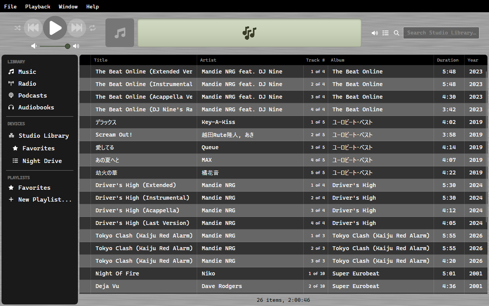

# Library Sharing

One copy of OrgZ can serve its library to another over the local network,
read-only. The other copy sees the shared tracks and playlists in its sidebar,
plays them straight off the wire, and can copy the ones it wants into its own
library.

## Sharing your library

Open **Settings → Services**:

- **Share my library on this network (read-only)** turns the share on and off.
  It takes effect immediately - it is a live network state, not a pending edit,
  so there is no OK to press.
- **Share name** is what the other machines see. It defaults to
  *`<computer name>` Library*.
- **Status** reports what is actually happening: the share name and port when
  it's up, *Not sharing* when it isn't.

The share is hosted by OrgZ's background service rather than by the window, so a
closed OrgZ doesn't take the library off the air. Where the service isn't
available, the checkbox is disabled and the status line says so. Tick
**Keep Running After OrgZ Closes → Library sharing** to leave the share up after
you quit.

!!! note "Read-only by construction"
    The server has no route that changes anything. It answers four requests: the
    catalogue, the playlists, a track's audio (with range requests, so a remote
    can seek), and cover art. There is no upload, delete, or edit path to reach.

**On the wire:** the share announces itself over mDNS as `_orgz._tcp` on port
7391 and serves over TLS with a self-signed certificate, whose fingerprint rides
the announcement so clients can pin it. The certificate is created once and kept
beside the library database, so the pin stays stable across restarts. This is
privacy-grade, not PKI-grade: it stops passive listeners reading your titles and
audio off the wire. Treat it as something you turn on for a network you trust.

## Using someone else's share

Nothing to configure. OrgZ browses for shares at startup and every 30 seconds
after that; anything it finds mounts under **DEVICES** in the sidebar with a
network icon - a share is a place your music comes from, like an iPod. Your own
share is never mounted back into your own sidebar.

- Click the share to browse its tracks. Double-click one to play it; audio
  streams from the other machine, nothing is copied.
- The remote's playlists (and its Favorites) hang under the share, the way a
  device's playlists do.
- Shared tracks are kept out of your **Music** view - they're the share's, not
  yours.
- Ratings and the row tick aren't offered on a share's tracks: a read-only
  library has nowhere to store them.

When the other machine goes away, the share unmounts and its tracks disappear
from the list. New tracks added on the remote show up on the next refresh.

## Copying tracks into your library

- **Tracks**: select them and drag them onto **Music** in the sidebar. Each is
  downloaded over its stream URL and filed in your library folder the same way a
  CD rip is.
- **A whole playlist**: right-click it under the share and choose **Import
  Playlist**. The tracks are copied first, then a local playlist is created from
  the ones that made it.

## Troubleshooting

| Symptom | Likely cause |
|---------|--------------|
| The share checkbox is greyed out | The background service isn't answering; sharing runs inside it. |
| A share doesn't appear on the other machine | mDNS doesn't cross subnets, and many access points block multicast between wireless clients. Both machines must be on the same LAN segment, with port 7391 reachable. |
| A share appears then vanishes | The catalogue fetch failed or the host went to sleep; OrgZ unmounts a share it can no longer see. |
| Imported tracks are missing some of the playlist | Only tracks that downloaded successfully are added to the local playlist. |
