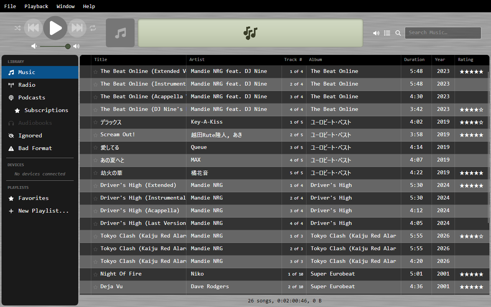
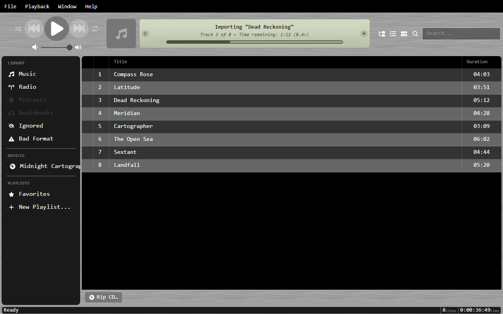
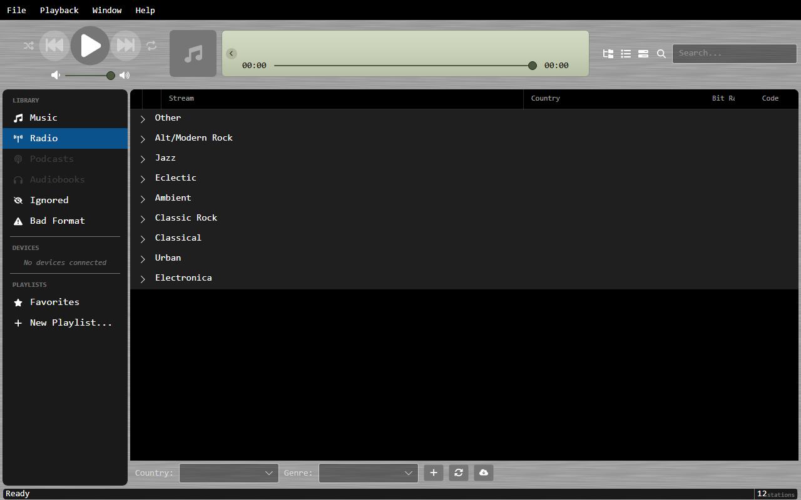

# OrgZ

**GATTA ORGANIzE** — A cross-platform music and radio player built with .NET and Avalonia.

  

    
    
    
    
  

  

OrgZ helps you manage your local music library and discover internet radio stations from Radio Browser and SHOUTcast, all in one place.

## Key Features

- **Music Library** — Scan and organize your local audio files with full metadata extraction
- **CD Ripping** — Rip audio CDs to FLAC or MP3 with MusicBrainz metadata and cover art
- **Radio Stations** — Browse and stream internet radio from Radio Browser and SHOUTcast
- **Podcasts** — Subscribe to shows, auto-download episodes on your own rules, and resume playback
- **Favorites** — Star your favorite tracks and stations for quick access
- **Devices** — Detect iPods (stock firmware and Rockbox) and sync music, playlists, and album art
- **Playback Continuity** — Navigate freely while your music keeps playing from where you started
- **System Integration** — Windows media keys, taskbar controls, and System Media Transport Controls

## Quick Links

- [Installation](getting-started/installation.md)
- [First Launch](getting-started/first-launch.md)
- [Keyboard Shortcuts](features/keyboard-shortcuts.md)
- [Changelog](changelog.md)
