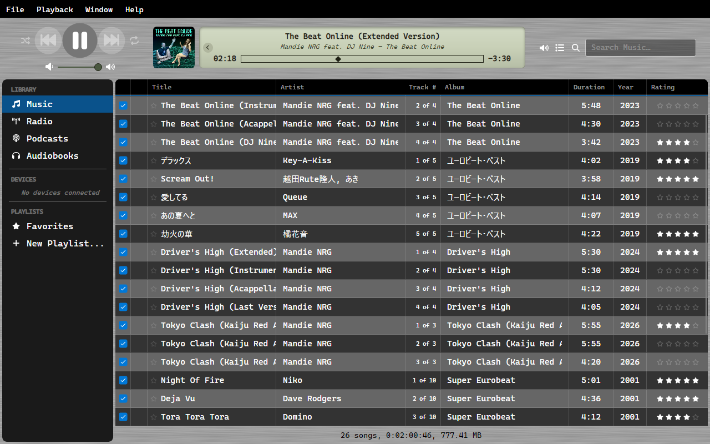
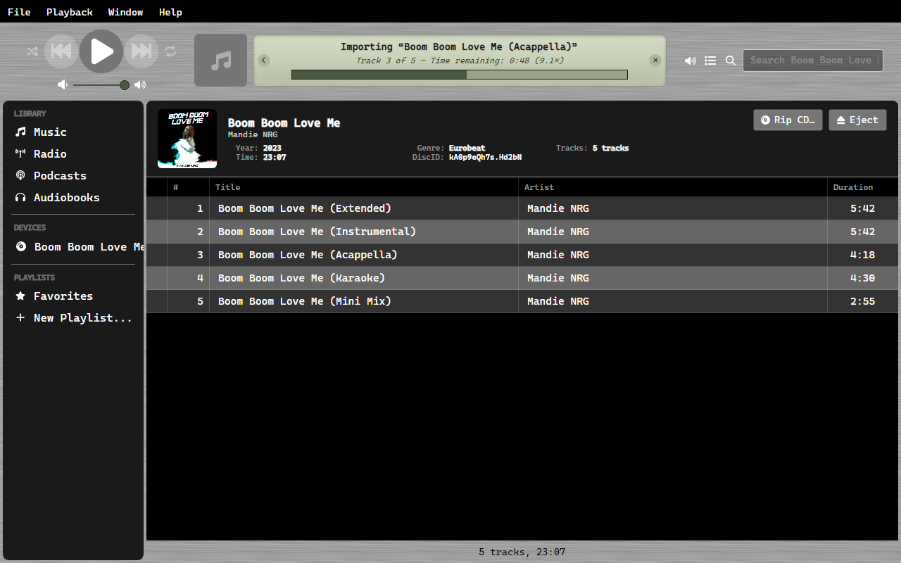
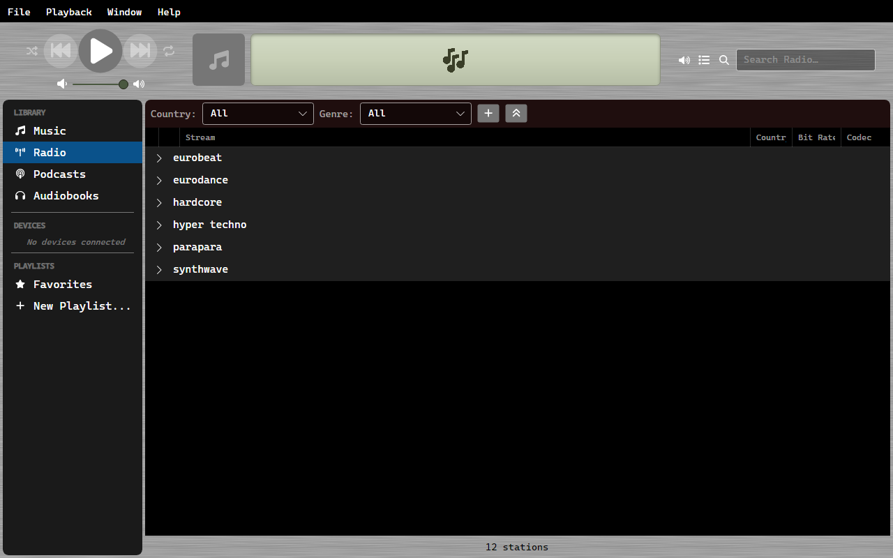

# OrgZ

**GATTA ORGANIzE**: A cross-platform music and radio player built with .NET and Avalonia.

  

    
    
    
    
    
  

  

OrgZ manages a local music library, rips CDs, streams internet radio, subscribes to podcasts, and syncs music to iPods.

## Features

- **Music library**: scans local audio files and reads tags, album art, and duration.
- **CD ripping**: rips audio CDs to FLAC or MP3 and fills in titles, artist, album, year, and cover art from MusicBrainz.
- **Internet radio**: a curated station catalogue ships with the app, and you can add, edit and favourite your own streams.
- **AirPlay**: streams to AirPlay 2 receivers - HomePods, Apple TVs and Macs - alongside or instead of the local sound device.
- **Library sharing**: share your library with another copy of OrgZ over the network, encrypted and certificate-pinned.
- **CD burning**: burns audio and data discs, with CD-TEXT and disc erase.
- **Audiobooks**: a dedicated shelf that resumes at the furthest chapter.
- **Podcasts**: subscribes to feeds, downloads episodes on configurable rules, and resumes playback where it left off.
- **Playlists as files**: every playlist is an `.m3u8` in your music folder, and any `.m3u8` you drop there becomes a playlist - nothing to import, nothing locked in a database.
- **Favorites**: stars tracks and stations, and writes the list out as `Favorites.m3u8` for other software to read.
- **iPod and Rockbox**: detects connected iPods (stock firmware and Rockbox) and copies tracks, playlists, and album art to supported models.
- **Playback**: keeps playing as you move between views; supports shuffle, repeat, and a compact mini-player.
- **System integration**: media keys, taskbar controls, and System Media Transport Controls on Windows; Now Playing on macOS.

## Quick Links

- [Installation](getting-started/installation.md)
- [First Launch](getting-started/first-launch.md)
- [Playlists](features/playlists.md)
- [Keyboard Shortcuts](features/keyboard-shortcuts.md)
- [Changelog](changelog.md)
