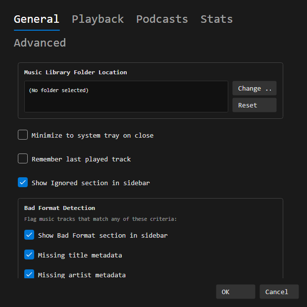

# Settings

Access settings via **File > Settings** or the native menu bar.

## General

- **Music Library Folder Location** - Change or reset the folder OrgZ scans for music
- **Minimize to system tray on close** - Keep OrgZ running in the background
- **Remember last played track** - Resume playback on next launch

## Playback

- **Streaming Buffer Size** - Adjust buffer for radio streams (Small / Medium / Large / Extra Large)
- **Shuffle by** - Shuffle by Song or Album
- **Auto-advance to next track** - Automatically play the next track when the current one ends

## Podcasts

Defaults applied to every subscription (each can be overridden from the podcast's own page):

- **Check for new episodes** - Hourly, Daily, Weekly, or Manually
- **When new episodes are available** - Download all, Download the most recent one, or Do nothing
- **Keep** - all, unplayed only, or the last 1 / 2 / 5 / 10 episodes

**Downloads** shows the download folder (with a button to open it) and the space used, plus **Clear downloads** to remove them and **Refresh subscriptions now** to check immediately. See [Podcasts](features/podcasts.md) for the full workflow.

## Stats

View detailed statistics about your library including track counts, file types, total duration, and radio station breakdowns.

## Advanced

- **Database Location** - Shows where the SQLite library database is stored
- **Settings File Location** - Shows where the JSON settings file is stored
- **Clear Radio Cache** - Remove all cached radio station data
- **Reset All Settings** - Restore all settings to defaults
