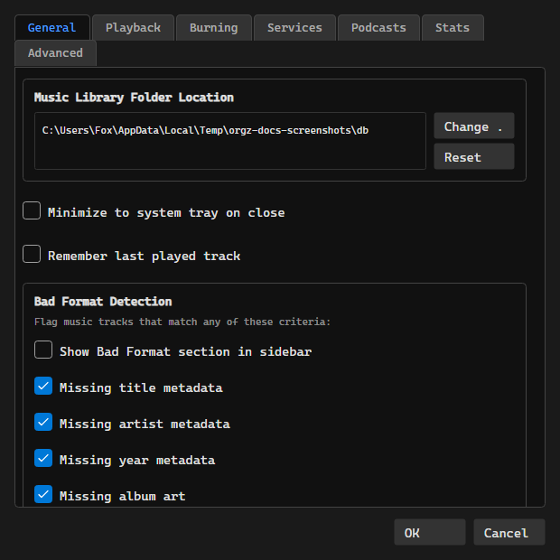

# Settings

Access settings via **File > Settings** or the native menu bar.

## General

- **Music Library Folder Location**: Change or reset the folder OrgZ scans for music
- **Minimize to system tray on close**: Keep OrgZ running in the background
- **Remember last played track**: Resume playback on next launch
- **Bad Format Detection**: Which tracks get flagged into the Bad Format section - missing title, artist, year, or album art, and optionally every lossy format. **Show Bad Format section in sidebar** hides the section without losing the criteria.

## Playback

- **Streaming Buffer Size**: Adjust buffer for radio streams (Small / Medium / Large / Extra Large)
- **Shuffle by**: Shuffle by Song or Album
- **Auto-advance to next track**: Automatically play the next track when the current one ends
- **Normalize volume (Sound Check)**: Levels loudness across tracks so quiet and loud songs play at a similar volume. Applies from the next track.
- **Mini-player mode**: Whether ++alt+shift+m++ replaces the main window (iTunes-style) or shows the mini-player alongside it

## Burning

Defaults for the **Burn Disc** dialog; see [Burning Discs](features/burning-cds.md).

- **Audio CD → Gap between songs**: None (gapless) or 2 seconds
- **Audio CD → Write CD-TEXT**: Disc and per-track artist / title in the lead-in
- **Data Disc → Convert files to**: Keep original format, MP3, AAC, Apple Lossless, FLAC, or WAV
- **Data Disc → Lossy quality**: 128 / 192 / 256 / 320 kbps for the lossy targets
- **Disc Image**: Where disc images are kept - `.disc-images` inside your library folder. Shown, not editable.

## Services

- **Share This Library**: Turn on **Share my library on this network (read-only)**, give the share a name, and watch the status line. Sharing is hosted by OrgZ's background service, so the checkbox is disabled when that service isn't answering. See [Library Sharing](features/sharing.md).
- **Keep Running After OrgZ Closes**: Hand **iPod sync** and **Library sharing** to the background service so closing the window doesn't stop them. (Disc burns always survive the window - the service or the elevated helper owns the write.)

## Podcasts

Defaults applied to every subscription (each can be overridden from the podcast's own page):

- **Check for new episodes**: Hourly, Daily, Weekly, or Manually
- **When new episodes are available**: Download all, Download the most recent one, or Do nothing
- **Keep**: all, unplayed only, or the last 1 / 2 / 5 / 10 episodes

**Downloads** shows the download folder (with a button to open it) and the space used, plus **Clear downloads** to remove them and **Refresh subscriptions now** to check immediately. See [Podcasts](features/podcasts.md) for the full workflow.

## Stats

View detailed statistics about your library including track counts, file types, total duration, and radio station breakdowns.

## Advanced

- **Database Location**: Shows where the SQLite library database is stored
- **Settings File Location**: Shows where the JSON settings file is stored
- **Reset Window Sizes**: Restore the default size and position of every window and dialog
- **Reset All Settings**: Restore all settings to defaults
